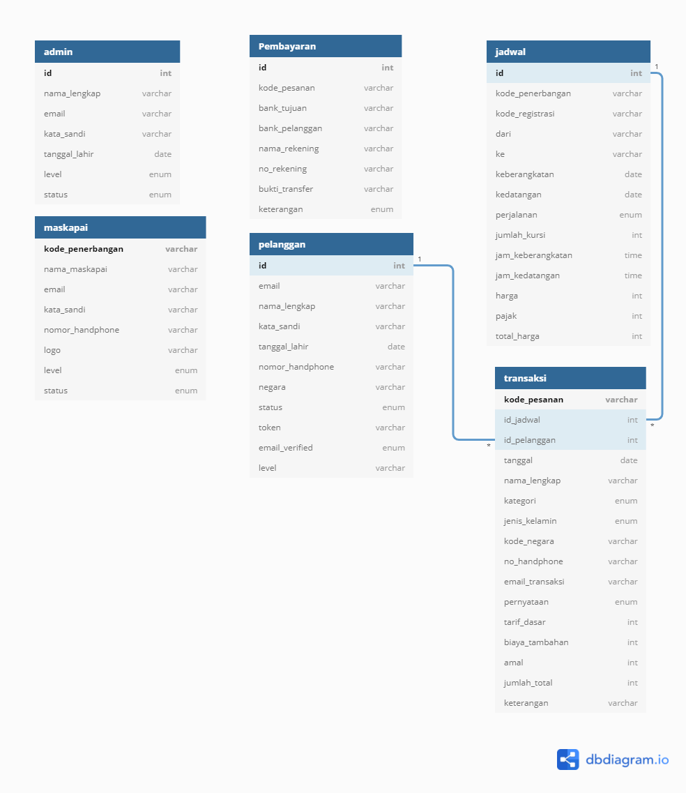

Plane merupakan situs pemesanan tiket online berbasis web yang dibuat menggunakan PHP

## ✨Description
Dengan melihat situs-situs maskapai yang masih aktif ternyata ada sebuah maskapai belum menggunakan sistem pemesanan tiket pesawat berbasis online. Sistem pemesanan atau pembelian tiket dapat dilakukan melalui telepon, mendatangi agen perjalanan ataupun datang langsung ke loket maskapai. Bagi perusahaan maskapai pemesanan tiket pesawat berbasis online ini merupakan salah satu pemanfaatan media internet dalam melakukan penjualan tiket. Dengan adanya website pemesanan tiket pesawat ini maka para penumpang diberikan kesempatan untuk memperoleh tiket secara online, cukup dengan membuka alamat situs website pemesanan tiket pesawat maka calon penumpang dapat melakukan transaksi pembelian tiket.
Keuntungan lain yang didapatkan oleh calon penumpang adalah dengan menggunakan website pemesanan tiket pesawat ini calon penumpang dapat mengupdate informasi berupa jadwal penerbangan dan harga tiket yang diberikan oleh pihak maskapai setiap saat.

## ✨Struktur Database

## ✨Fitur

Terdapat banyak fitur yang tersedia di dalam plane dengan macam-macam hak akses user

👨‍🎓 Admin: 

🟡 Login

🟡 Lupa Kata Sandi

🟡 Logout

🟡 Mengelola Maskapai (Lihat Maskapai, Tambah Maskapai, Edit Maskapai, Hapus Maskapai)

🟡 Mengelola Jadwal ( Lihat Jadwal ) 

🟡 Mengelola Transaksi ( Melihat halaman transaksi, Konfirmasi Transaksi, Cek Status Pembayaran ) 

🟡 Mengelola Laporan

🟡 Mengelola Pelanggan

🟡 Merubah Profile

🟡 Dashboard

👨‍🎓 Maskapai:

🟡 Login

🟡 Lupa Kata Sandi

🟡 Logout

🟡 Mengelola Jadwal ( Lihat Jadwal, Tambah Jadwal, Edit Jadwal, Hapus Jadwal ) 

🟡 Merubah Profile

🟡 Dashboard

👨‍🎓 Pelanggan:

🟡 Daftar

🟡 Verifikasi Email

🟡 Login

🟡 Lupa Kata Sandi

🟡 Logout

🟡 Mencari Jadwal Penerbangan

🟡 Memesan Tiket Pesawat

🟡 Mengisi Data Pemesanan dan Penumpang

🟡 Memilih Metode Pembayaran

## ✨Tech
Plane dibuat dengan menggunakan: 

## ✨Connect With Me

